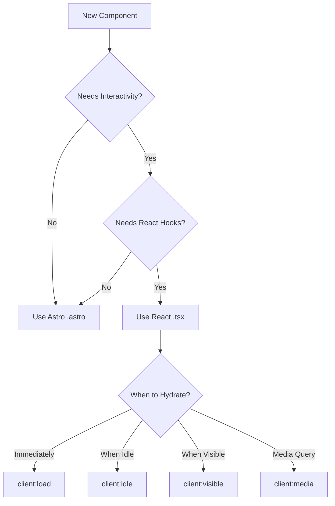

## Overview

The Drakk3 Portfolio uses Astro as the primary framework with React for interactive components. This hybrid approach combines the performance of static site generation with the interactivity of a modern JavaScript framework.

## How Astro and React Work Together

Astro and React integration follows a **static-first** philosophy:

<Steps>
  <Step title="Default: Static HTML">
    All components render to static HTML at build time. No JavaScript is shipped to the browser by default.
  </Step>
  
  <Step title="Opt-in to interactivity">
    Use client directives (like `client:load`) to hydrate React components on the client.
  </Step>
  
  <Step title="Islands of interactivity">
    Only components with client directives load JavaScript, creating "islands" of interactivity in a sea of static HTML.
  </Step>
</Steps>

### Configuration

The React integration is configured in `astro.config.mjs:12`:

```typescript title="astro.config.mjs"
import { defineConfig } from 'astro/config';
import react from '@astrojs/react';
import tailwindcss from '@tailwindcss/vite';

export default defineConfig({
  integrations: [react()],
  vite: {
    plugins: [tailwindcss()],
    resolve: {
      alias: {
        '@': path.resolve(__dirname, './src'),
      },
    },
  },
});
```

<Note>
  The `@astrojs/react` integration allows you to use React components (`.tsx`, `.jsx`) alongside Astro components (`.astro`).
</Note>

## Client Directives

Client directives tell Astro **when** and **how** to hydrate a React component on the client side.

### The `client:load` Directive

The most common directive in this project is `client:load`, used for the Contact form:

```astro title="src/pages/index.astro:19"
<Contact client:load />
```

**What it does:**
- Hydrates the component **immediately** on page load
- Loads the React runtime and component JavaScript as soon as possible
- Ensures the component is interactive ASAP

**When to use:**
- Components that are immediately visible (above the fold)
- Critical interactive elements like forms, navigation menus
- Components where delayed hydration would be noticeable to users

### Real-World Example: Contact Form

The Contact component requires immediate interactivity because:

1. **Form state management** - Uses `useState` for form status (`src/components/Contact.tsx:10`)
2. **User interactions** - Handles form submission immediately
3. **Visual feedback** - Shows loading states with `useTransition` (`src/components/Contact.tsx:11`)

```tsx title="src/components/Contact.tsx:9"
export default function Contact() {
  const [status, setStatus] = useState<FormState>('idle');
  const [isPending, startTransition] = useTransition();

  function handleSubmit(_formData: FormData) {
    startTransition(async () => {
      await new Promise<void>((resolve) => setTimeout(resolve, 900));
      setStatus('success');
    });
  }

  return (
    <section id="contact" className="py-24 border-t border-border">
      {/* Form UI */}
    </section>
  );
}
```

### Other Client Directives

While `client:load` is used in this project, Astro provides other directives for different use cases:

<Tabs>
  <Tab title="client:idle">
    Hydrates the component when the browser is idle (uses `requestIdleCallback`).
    
    ```astro
    <Analytics client:idle />
    ```
    
    **Best for:** Analytics, chat widgets, non-critical interactive features.
  </Tab>
  
  <Tab title="client:visible">
    Hydrates when the component enters the viewport (uses `IntersectionObserver`).
    
    ```astro
    <ImageGallery client:visible />
    ```
    
    **Best for:** Below-the-fold content, image galleries, carousels, tabs.
  </Tab>
  
  <Tab title="client:media">
    Hydrates when a media query matches.
    
    ```astro
    <MobileMenu client:media="(max-width: 768px)" />
    ```
    
    **Best for:** Mobile-only or desktop-only components.
  </Tab>
  
  <Tab title="client:only">
    Skips server-side rendering entirely. Only renders on the client.
    
    ```astro
    <WebGLCanvas client:only="react" />
    ```
    
    **Best for:** Components that depend on browser APIs (window, document, WebGL).
  </Tab>
</Tabs>

### Performance Comparison

| Directive | When Hydrated | JavaScript Load Time | Use Case |
|-----------|---------------|---------------------|----------|
| `client:load` | Immediately | ~0s | Critical interactive components |
| `client:idle` | When browser idle | ~0.5-2s | Non-critical features |
| `client:visible` | When scrolled into view | Varies | Below-fold content |
| `client:media` | When media query matches | Varies | Responsive components |
| `client:only` | Client-side only | ~0s | Browser-dependent components |

<Warning>
  Don't use `client:load` for everything! Each directive increases your JavaScript bundle. Use the most efficient directive for your use case.
</Warning>

## Choosing Astro vs React Components

### Decision Flow



### Practical Examples from This Project

<CardGroup cols={2}>
  <Card title="Navbar Component" icon="bars">
    **Technology:** Astro
    
    **Why:** Static navigation with anchor links. No JavaScript needed.
    
    ```astro
    <nav>
      <a href="#about">About</a>
      <a href="#projects">Projects</a>
      <a href="#contact">Contact</a>
    </nav>
    ```
  </Card>
  
  <Card title="Contact Component" icon="envelope">
    **Technology:** React + `client:load`
    
    **Why:** Requires form state, validation, submission handling, and dynamic UI updates.
    
    ```tsx
    const [status, setStatus] = useState('idle');
    const [isPending, startTransition] = useTransition();
    // Interactive form logic
    ```
  </Card>
</CardGroup>

## Passing Props Between Astro and React

### Serializable Props

You can pass data from Astro to React components, but props must be **JSON-serializable**:

```astro title="Example: Passing data to React"
---
const projects = [
  { id: 1, title: 'Project A', description: '...' },
  { id: 2, title: 'Project B', description: '...' },
];
---

<ProjectGallery projects={projects} client:visible />
```

**Serializable types:**
- ✅ Strings, numbers, booleans
- ✅ Arrays and objects (plain)
- ✅ `null` and `undefined`

**Non-serializable types:**
- ❌ Functions
- ❌ Class instances
- ❌ Symbols
- ❌ React components

<Warning>
  Props are serialized to JSON during build. Passing functions or class instances will fail.
</Warning>

### Prop Types

Define TypeScript interfaces for type safety:

```tsx title="Example: React component with props"
interface ProjectGalleryProps {
  projects: Array<{
    id: number;
    title: string;
    description: string;
  }>;
  displayMode?: 'grid' | 'list';
}

export default function ProjectGallery({ 
  projects, 
  displayMode = 'grid' 
}: ProjectGalleryProps) {
  return (
    <div className={displayMode === 'grid' ? 'grid' : 'flex'}>
      {projects.map(project => (
        <ProjectCard key={project.id} {...project} />
      ))}
    </div>
  );
}
```

## Path Alias Configuration

The `@/` alias simplifies imports across Astro and React components:

```typescript title="astro.config.mjs:16"
alias: {
  '@': path.resolve(__dirname, './src'),
}
```

### Usage in React Components

```tsx title="src/components/Contact.tsx:2"
import { Button } from '@/components/ui/button';
import { Input } from '@/components/ui/input';
import { Textarea } from '@/components/ui/textarea';
import { Label } from '@/components/ui/label';
```

### Usage in Astro Components

```astro title="Example Astro component"
---
import Layout from '@/layouts/Layout.astro';
import { projects } from '@/data/projects';
---
```

<Note>
  The `@/` alias works in both `.astro` and `.tsx` files thanks to Vite's resolver configuration.
</Note>

## Component Communication Patterns

### Parent Astro → Child React

Pass data down via props (as shown above).

### Sibling React Components

Use React context or state management libraries:

```tsx title="Example: Context provider in React"
import { createContext, useContext, useState } from 'react';

const ThemeContext = createContext('light');

export function ThemeProvider({ children }) {
  const [theme, setTheme] = useState('dark');
  return (
    <ThemeContext.Provider value={{ theme, setTheme }}>
      {children}
    </ThemeContext.Provider>
  );
}
```

### Astro ↔ React Communication

<Warning>
  Astro components and React components **cannot directly communicate** after build. Astro components are static HTML; React components are client-side.
</Warning>

**Solutions:**
1. **Pass initial data** via props during build
2. **Use URL state** (query params, hash) for cross-component communication
3. **Use localStorage/sessionStorage** for persistent state
4. **Fetch shared data** from an API on the client

## Best Practices

<CardGroup cols={2}>
  <Card title="Start Static" icon="file-code">
    Default to Astro components. Only reach for React when you need interactivity.
  </Card>
  
  <Card title="Choose the Right Directive" icon="clock">
    Use `client:visible` or `client:idle` instead of `client:load` when possible to reduce initial JavaScript.
  </Card>
  
  <Card title="Keep Props Simple" icon="database">
    Only pass JSON-serializable data between Astro and React components.
  </Card>
  
  <Card title="Use TypeScript" icon="shield-check">
    Define interfaces for React component props to catch errors at build time.
  </Card>
</CardGroup>

## Common Pitfalls

### 1. Forgetting the Client Directive

```astro
<!-- ❌ Wrong: React component won't be interactive -->
<Contact />

<!-- ✅ Correct: Component hydrates on client -->
<Contact client:load />
```

### 2. Passing Functions as Props

```astro
<!-- ❌ Wrong: Functions aren't JSON-serializable -->
<Modal onClose={() => console.log('closed')} client:load />

<!-- ✅ Correct: Handle events inside React component -->
<Modal client:load />
```

### 3. Using Browser APIs in Astro Components

```astro
<!-- ❌ Wrong: window/document don't exist during build -->
---
const width = window.innerWidth; // Error!
---

<!-- ✅ Correct: Use client-side React component -->
<ResponsiveComponent client:only="react" />
```

## Next Steps

<CardGroup cols={2}>
  <Card title="Architecture Overview" href="./overview">
    Understand the overall project architecture and structure
  </Card>
  <Card title="Tailwind v4 Configuration" href="./tailwind-v4">
    Learn about Tailwind CSS v4 native configuration
  </Card>
</CardGroup>
